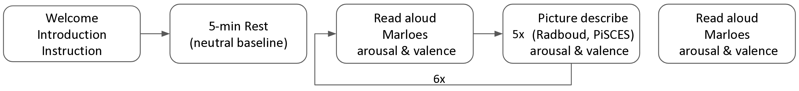
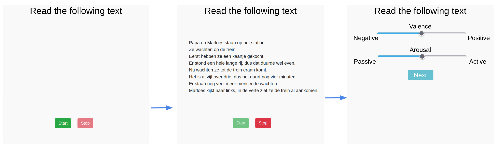
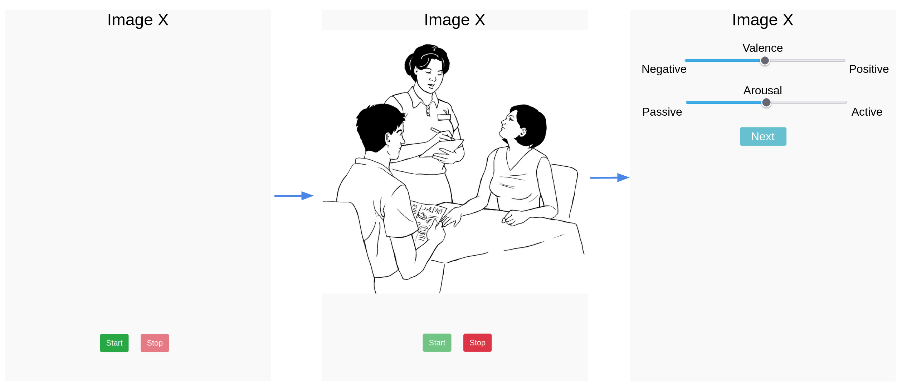

# Speech web app

This repository contains the web app implementation that was utilized to collect data in order to assess the acoustic properties of the *Ghent Semi-spontaneous Speech Paradigm* (GSSP), a new speech acquisition methodology in which participants were asked to describe images with a constant emotional load. 

89 Dutch-speaking participants fulfilled the web-app speech acquistion, which were enrolled through leveraging the researchers their network and the [prolific](https://www.prolific.co/) platform. 

**relevant links**:
- The dataset can be found on [Kaggle](https://kaggle.com/datasets/b5f57e5896f6035b509bd335c062166df0560ff637fd62196a5356c0d425c081)
- a preprint of the manuscript can be found on [psyarxiv]()
- The analysis of the dataset can be found on the [analysis]()

## Web app structure


Prior to the the web app its data acquisition, the participants loop through the following steps:
1. A `Welcome` page, which provides a general overview of the study's purpose
2. An `Introduction` page, which acquired demographics, together with informed consent<br>This page also showed guidelines for the GSSP task.
3. The `Instructions` page, which provides general instructions for the GSSP task. Specifically:
    - three [demo](app/static/video/) videos were shown how the task should be performed
    - the participants were instructed to read aloud the fixed "Marloes" text
4. A 5 minute `Rest` should bring participants into a neutral baseline state

- The First acquisition consists of the Rad-aloud `Marloes` task afer which the particpants fills in their experienced arousal and valence values during the task.

- Afterwards, 5 PSSG Picture descriptions were acquired (alternating between the [Radboud](app/static/img/Radboud/) and [PiSCES](app/static/img/PiSCES/) image subset). The first shown image always originates from the PiSCES subset. After each image, the participants filled in their experienced arousal and valence values during the task.


This was repeated 6 times, follwed by a Final Marloes acquisition, resulting in a total of 7 Marloes samples, 15 Pisces samples and 15 Radboud samples per participant.

The GSSP is already used in other studies. For example, the [fce_stripped]() branch contains a stripped version of the app in which participants who experienced Adverse Childhood events, filled in this quaestionnaire.


---
### Folder structure

```txt
└── app
   ├── API                     <- API endpoints / utlities
   ├── static
   │   ├── css
   │   ├── img                 <- images used in the app
   │   │   ├── demo
   │   │   ├── PiSCES
   │   │   └── Radboud
   │   ├── _js                 <- javascript files used in the app (audio recording)
   │   ├── sound               <- sound files used in the app
   │   └── video               <- demo video of GSSP task
   └── templates               <- jinja html templates
```

---
## Running the web app
### Via Python

Set first DEPLOY to `False` in the Appconfig class of [app/config.py](app/config.py)
```bash
# create a virtual environment
virtualenv -p /usr/bin/python3.8 .venv
source .venv/bin/activate

# install the required packages
pip install -r requirements.txt

# start the app
python app/main.py # the app should be accessible on localhost:8080

```
### Via Docker 

Make sure that DEPLOY is set to `True` in the Appconfig class of [app/config.py](app/config.py)

```bash
# build the image 
docker build .
# you should have an output "sucessfully built <IMAGE_ID>" on the last line

# test the image
docker run -it -p 8081:80 <IMAGE_ID>
```